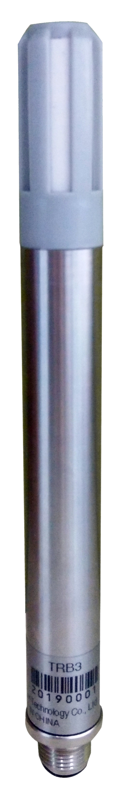

<h1 id="header">
    

</h1>

#
 <!--  -->
- <a href="https://pan.baidu.com/s/1TyTfpMy_2gkQg6gymu4K4w">TRB3校准证书</a>，百度网盘提取码：0000
- <a href="https://pan.baidu.com/s/1jricogE6RVI3_FLh9_v9oQ">TRB3说明书</a>，百度网盘提取码：0000

### 概述
- TRB3温湿压传感器是一款集成型，简单数字信号（SDI-12），适用全天候的一款传感器。可输出：空气温度，相对湿度，大气压力

### 参数
- 工作温度：-40℃～+70℃
- 输出方式：SDI-12
- 温度
    - 测量范围：-40°C至 +70°C
    - 测量精度
        - ±0.2°C至±0.3°C（-40°C至 +70°C）
        - ±0.1°C至±0.3°C（+20°C至 +60°C）
- 湿度
    - 测量范围：0-100%RH
    - 测量精度：
        - ±1.5%～±2%（0至80% RH）@25℃
        - ±2%～±3%（80%至100% RH）@25℃
- 大气压精度
    - 测量范围：300至1200mbar
    - 测量精度：±1hPa

### 电气特性
- 供电电压：7V～28VDC
- 静态电流：100μA@12V
- 工作电流：1.5mA@12V 
### 物理特点
- 标准M12防水接口，整体防护等级IP67 

<a href="#header">回到顶部</a>  
<!-- [回到首页](./index.md) -->
<!-- -  -->